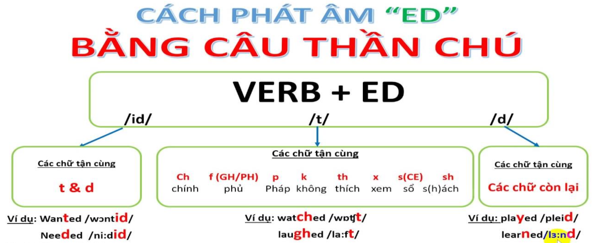

# Quá khứ đơn

## Getting Around – Simple Past Verbs  = Di Chuyển – Động Từ Quá Khứ Đơn

| English | Tiếng Việt |
|---|---|
| “Getting Around” uses mostly simple past verbs. | Bài học chủ đề “Getting Around” chủ yếu sử dụng động từ ở thì quá khứ đơn. |
| Many of them end in “-ed”, but many others do not. | Nhiều động từ kết thúc bằng “-ed”, nhưng nhiều động từ khác thì không. |
| Examples: | Ví dụ: |
| Mike walked to the store. | Mike đã đi bộ đến cửa hàng. |
| [a “regular” verb] | [một động từ “có quy tắc”] |
| I took a bus to work. | Tôi đã đi xe buýt đi làm. |
| [an “irregular” verb] | [một động từ “bất quy tắc”] |
| Irregular past forms are listed in brackets [ ] in Key Vocabulary. | Các dạng quá khứ bất quy tắc được liệt kê trong ngoặc [ ] ở phần Từ Vựng Chính. |

---

## Some Time Expressions with Past-Tense Verbs = Một Số Cụm Chỉ Thời Gian Dùng Với Động Từ Quá Khứ

| English | Tiếng Việt |
|---|---|
| Yesterday | hôm qua |
| Phrases with “last” | Các cụm với “last” |
| last week | tuần trước |
| last year | năm ngoái |
| last month | tháng trước |
| last Monday, etc. | thứ Hai tuần trước, v.v. |
| Phrases with “ago” | Các cụm với “ago” |
| two weeks ago | hai tuần trước |
| a few minutes ago | vài phút trước |
| five days ago | năm ngày trước |
| a year ago | một năm trước |

---

## Pronunciation Guide = Hướng Dẫn Phát Âm

> 

---
